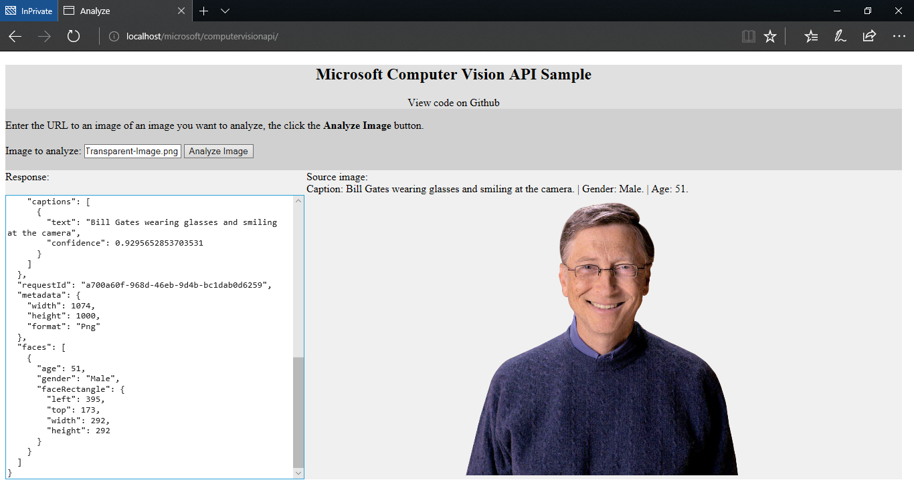

# Microsoft Computer Vision API - Image Analyzer

This is a javascript sample from Mirosoft Computer Vision API.

## How-to-Use

Just change the `subscriptionKeyInput` on `index.html` with your own subkey.

Get your subcription key on Azure Portal, or here:

[https://azure.microsoft.com/en-us/try/cognitive-services/?api=computer-vision](https://azure.microsoft.com/en-us/try/cognitive-services/?api=computer-vision)

## More Details

[https://github.com/Azure-Samples/cognitive-services-javascript-computer-vision-tutorial](https://github.com/Azure-Samples/cognitive-services-javascript-computer-vision-tutorial)
